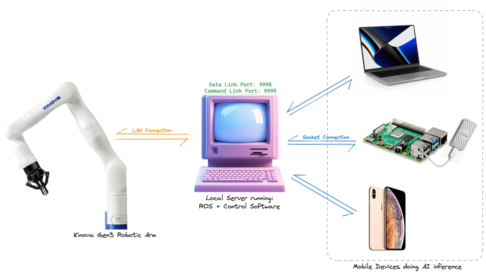

# Kinova Robotic Arm - Embodied AI Experiments


- Technical Report: [coming soon]
- Demonstration: [coming soon]
- Detailed Control Flow: [coming soon]

## Requirements
<div>

- Decent graphic card, or Apple M-series device
- Minimum 8GB RAM
- 10+ GB free storage

</div>

<div>

- Conda | [docs](https://docs.conda.io/projects/conda/en/latest/user-guide/install/index.html)
- Python 3.10.14
- Phi-3-mini-4k-instruct-q4 language model | [🤗 Page](https://huggingface.co/microsoft/Phi-3-mini-4k-instruct-gguf)
- clipseg-rd64-refined (auto downloaded) | [🤗 Page](https://huggingface.co/docs/transformers/en/model_doc/clipseg)

</div>

## Environment Setup
1.  Create conda environment
    ```sh
    conda create -n kinovaAi python=3.10.14
    ```
1. [Download](https://huggingface.co/microsoft/Phi-3-mini-4k-instruct-gguf/blob/main/Phi-3-mini-4k-instruct-q4.gguf) the LM and move it to [llm_models](./llm_models/)

1. Install packages:
    ```sh
    pip install -r requirements.txt
    ```

## Embodied AI Inference

1. Activate conda environment.
    ```sh
    conda activate kinovaAi
    ```

1. Set the IP address of host server (i.e. running ROS, Kortex API & connected to arm) in [inference2_clipseg.py](./embodied_ai/inference2_clipseg.py).

    Example: `HOST_IP = '192.168.1.100'`

1. Start the server first by following the **Remote AI Inference** instructions on [rishiktiwari/rishik_ros_kortex](https://github.com/rishiktiwari/rishik_ros_kortex/blob/master/readme.md#remote-ai-inference)


1. Run the following command to connect to server and begin inference script:
    ```sh
    python3 embodied_ai/inference2_clipseg.py
    ```
    > inference1_gdino is incomplete and not recommended.

    > Only actions translating to pick or pick_place are supported.
    > English prompt works the best!

### Device connection overview

